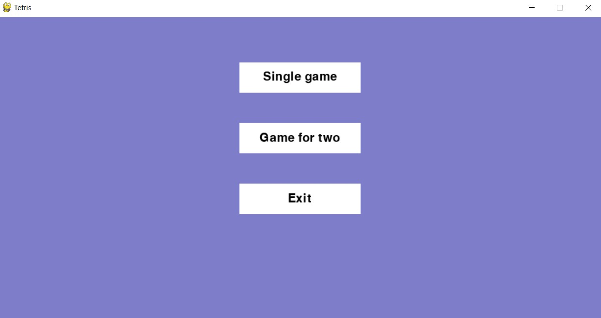
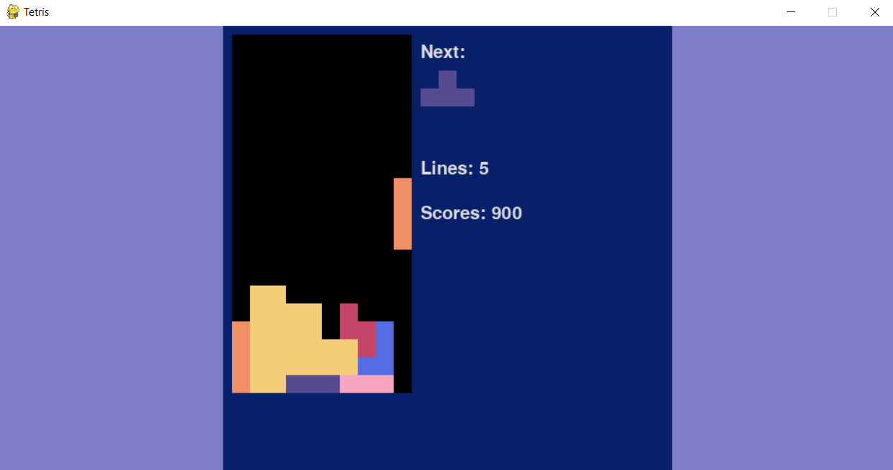
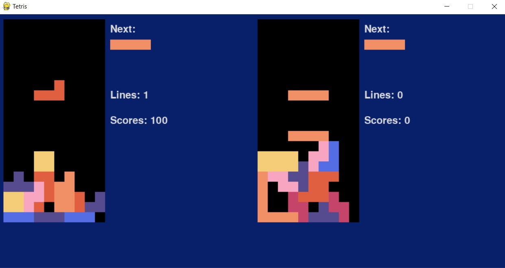

# Tetris with pygame
Tetris game created with python 3.10 and pygame.

##How to run:

install requirements:

    pip install -r requirements.txt

or just:

    pip install pygame

Then run main.py manually or using:

    python main.py

##Screenshots:

